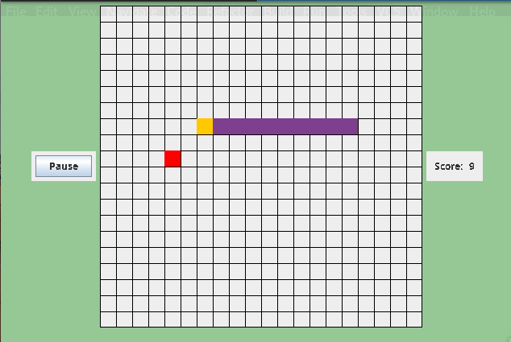

# Snakes
## The classic Snakes game on Java
CIS 1200 Final Project

Implemented using Java.

### Usage

Run the class Game under src/main/java/org.cis1200/snakes/Game 

### Specification

- Landing page: page where you can select to play a new game or play the last saved game and see the highest score

- Modes: Classic Snake mode, Portals Snake mode, Hole Snake mode, each of one with its own functionalities

- Tutorial page: all the modes has a tutorial page before the game starts

- Buttons and functions during the game: Pause/Play, Reset, Save & Quit buttons, real time score tracker

- I/O files: used to save the last saved game and highest score

- Unit Tests (/test): JUnit tests testing various classes 
 
